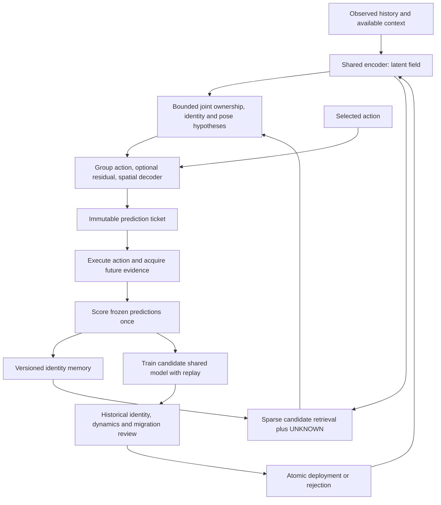

# MORPH architecture capture

Captured 2026-10-04 from [the research post](https://spencerbug.github.io/blog/morph/), revision dated 2026-10-03. A local [source snapshot](sources/README.md) fixes provenance. Section numbers below refer to the post. This document extracts the intended system; [SPEC.md](../SPEC.md) alone defines the active implementation experiment. No model or experiment has been implemented or run.

## 1. Claim and scope

MORPH proposes three coupled capabilities: allocate persistent individual identities as nonparametric memories; predict action consequences through a shared equivariant representation; improve that representation while explicitly transporting historical memories and dynamics into its new coordinates. Temporal escrow governs both evidence credit and deployment of candidate model updates (§§1–2, 5, 11, 18).

The core hypothesis is a conjunction, not one benchmark score: structured prediction should transfer across lawful action compositions; fast memory should retain individual identities; controlled migration should preserve useful old knowledge while allowing new learning; escrow should reduce self-confirming errors in the coupled loop. None is validated by the post. Group-structured autoencoding and identity-as-orbit are acknowledged precedents, particularly HAE (§15), not MORPH novelty claims.

Legend used here:

- **Article:** explicit architectural intent, not empirical fact.
- **Inference:** needed to make the stated mechanisms coherent, but not fully specified by the article.
- **Decision E0:** provisional engineering choice for the active experiment.
- **Open:** requires design or evidence; no silent default is authorized as a scientific conclusion.

The post's “minimal prototype” already contains grouping, retrieval, memory, learning and migration. E0 deliberately precedes that prototype. Success on centered 2-D rotation would support only a limited predictive-substrate claim, not open-ended embodied identity.

## 2. Information boundary

| Quantity | Intended system | E0 decision |
|---|---|---|
| Sensor observations | Patch histories of length L+1; vision initially, other modalities later | One complete 32×32 grayscale image, L=0 |
| Time | Event ordering and elapsed physical time, distinct from inference iterations | Discrete steps with fixed duration; actions are angle increments |
| Action | Command selected before outcome; command alone does not specify each object's motion | Exact commanded object rotation about known image center |
| Context | Available proprioception, execution measurements, sensor calibration and history, with timestamps | No additional context; deterministic actuator and fixed camera |
| Identity / object count | Unknown persistent vocabulary; retrieved alternatives and UNKNOWN | Exactly one object per episode by environment design; no identity labels to learner |
| Ownership / segmentation | Inferred jointly with grouping and pose; not given | Whole image assigned to single object; background fixed |
| Pose / center / depth | Latent and uncertain; absolute pose not required at inference | No absolute angle input or target; fixed center is supplied by scene construction |
| Ground truth | Simulator identity and pose used for evaluation, not identity training (§16) | IDs, absolute angle, symmetry order and foreground mask in evaluator-only records |
| Future evidence | Unavailable at prediction commitment | Evaluator withholds all future frames until rollout predictions are frozen |
| Unseen surfaces / occluded parts | Cannot be recovered uniquely from partial evidence | Excluded from E0 |
| Other agents' motion / contact | Must be inferred or modeled with uncertainty | Excluded from E0 |

Reliable same-instance associations are themselves an assumption. E0 uses temporal continuity within a single-object episode, never ground-truth IDs across episodes. A batch of episodes is not automatically a set of distinct objects. In the full system, uncertain tracks must not silently become positive labels, and retrieved mismatches are not hard negatives until independently challenged (§§8–9).

An image cannot distinguish observationally identical physical instances. A symmetric view need not reveal a unique orientation. Neither recurrence nor a transform can create absent information. UNKNOWN, multiple poses and unresolved associations are necessary outcomes.

## 3. Executable flow implied by the article

Article (§§2–8): encode before assigning ownership; use local retrieval only as proposal; refine grouping and pose together under bounded recurrence; transform pose, recompose and decode future sensor evidence; commit; act; score; then update memory and train candidates. A prediction must include where features will appear, not merely the next value at the same patch address.

Inference: deployment is a transaction across encoder, decoder, factorizer, dynamics, retrieval metric/index and memory versions. Updating only the encoder or only the group matrices cannot guarantee compatibility. Keep a rollback bundle until validation succeeds.

## 4. What is learned, stored, predicted and evaluated

| Component | Learned shared state | Nonparametric / operational state | Prediction and evaluation |
|---|---|---|---|
| Encoder E | Patch/history-to-latent mapping | Raw anchors and encoder version | Reconstruction, useful variance, equivariance on matched evidence |
| Factorizer F, composition C | Identity/pose extraction and recomposition | Alternative ownership and pose states | Invariance, pose-sensitive prediction, leakage and ambiguity |
| Retrieval I and ANN | Key mapping / metric | Versioned local prototypes → parent memory IDs | Candidate recall at K, latency, growth, cross-version recall |
| Memory | No private deep model per identity | Descriptors, orbit/view anchors, traces, uncertainty, relations | Splits, merges, return-after-absence, allocation precision/recall |
| Action f and group representation ρ | Command/context → motion generator; possibly representation generators | Frame conventions and action/execution trace | Sensor prediction, composition, inverse consistency where valid |
| Residual r | Shared non-group correction, trained in a controlled stage | Frozen group-path target version | Incremental sensor improvement, magnitude, takeover |
| Decoder D | Latent-field-to-sensor prediction | Projection / visibility context | Real pixel or modality likelihood/error; never only latent fit |
| Vigilance / grouping | Calibration and optionally grouping machinery | Candidate budget, thresholds, provisional associations | False accepts/rejects, grouping quality, calibration |
| Migration Q | Compatibility map fitted with candidate update | Version graph, held-out anchors, missing feature masks | Historical geometry, identity, dynamics and new utility |
| Evidence ledger | No learned mechanism required | Immutable tickets, observation IDs, score events | No future leakage, no repeated evidence credit |
| Active policy | Optional learned policy; not prescribed | Available actions, costs and constraints | Disambiguation per action versus random/passive policy |

Reconstruction is a training signal, not validation of the identity initialized from that same image. Future sensor error can evaluate prediction without a calibrated probability model; it cannot automatically be called a likelihood ratio or confidence (§§5, 8).

## 5. Tensor contract: full architecture versus E0

The post supplies equations but **no numeric dimensions, network topology, dtypes, padding rules or batching protocol**. These are not extracted facts. Suggested full-system interface notation:

| Symbol | Shape | Meaning |
|---|---|---|
| X | [B,L+1,C,H,W] | Observed image histories, explicit timestamps |
| Xpatch | [B,N,L+1,C,h,w] | Fixed patches with image-position metadata; N determined by tiling |
| Z | [B,N,dz] | Shared latent field |
| Klocal | [B,N,dk] | Retrieval keys, not object IDs |
| CandidateIDs, mask | [B,N,K] | Sparse IDs with padding; UNKNOWN handled explicitly |
| W | [B,N,J+1] | Ownership weights over current instances plus background/unknown |
| U | [B,J,du] | Approximately invariant instance descriptors |
| P, mixture weights | [B,J,S,dp], [B,J,S] | Bounded pose alternatives; S=1 cannot express multimodality |
| ξ | [B,J,dim(G)] | Candidate-relative motion generator with declared frame/units |
| ρp(g) | [B,J,dp,dp] | Physical action operator, shared across compatible instances |
| Zhat, What | Declared field/object layout | Predicted state plus projection/correspondence and visibility |
| Xhat | [B,C,H,W] or distribution parameters | Sensor-space prediction |
| Q | [dold,dold] | Protected-block migration, not physical motion |

These are **proposed interface shapes**, not a commitment to dense allocation across every historical identity. J counts current instances; persistent library size M can grow independently. W must have a validity mask and normalized assignments; unknown ownership and unseen pixels are distinct concepts. Probability calibration, mixture count, patch size and budgets remain open for the full system.

**Decision E0:** B×1×32×32 inputs; encoder outputs u∈R32 and p∈R16; z=[u;p]∈R48. p reshapes to [B,4,2,2]: harmonic frequency, copy, 2-vector. The decoder consumes z directly. No patch inference, memory index, uncertainty head or residual exists in E0. See SPEC for exact transforms and model contract.

## 6. Pose, coordinates, actions and symmetry

**Article:** pose is transformation state relative to anchors, not necessarily calibrated meters/radians. Physical group action applies to pose; identity should remain stable; C(u,ρp(g)p)≈ρz(g)C(u,p). Joint factorization is a research problem, not an automatic property of any equivariant encoder (§§2–3, 8).

**Decision E0:** physical group SO(2); mathematical x points right and y up, with origin at image center. Tensor rows increase downward. Positive action α is counterclockwise rotation of the object, camera fixed. α is a signed increment in radians, not angular velocity, so do not multiply by Δt again. Column-vector block R(kα)=[[cos(kα),−sin(kα)],[sin(kα),cos(kα)]] acts on each copy at k=1,2,3,4. For row-batched tensors use the corresponding transpose. p'=ρp(α)p, u'=u, ρz=diag(I32,ρp). C is concatenation. Sequence α1 then α2 uses ρ(α2)ρ(α1); this group is commutative, so E0 cannot test noncommuting motion order.

The 16 coordinates are pose-bearing features, not a 16-DOF physical pose or a supervised angle. Amplitudes may carry identity information: factorization is useful but not identifiable solely from these losses. Multiple copies/harmonics allow variation and symmetry without enforcing a unique canonical angle. Absolute pose receives **no supervision**, including during training; a global phase/gauge per learned representation is unidentifiable. An optional diagnostic probe must be fit on a separate probe split and never feed the predictor.

For n-fold symmetric objects, θ and θ+2π/n are equivalent. Pose belongs conceptually to G/Stab(object). E0 does not estimate a single θ, and evaluates images and equivariance rather than penalizing equivalent angles. Under exact equivariance incompatible harmonics must vanish on such objects. Include 2-fold and 4-fold symmetry diagnostic sets; a continuous-symmetry object may legitimately have zero rotating features. Zero p on all asymmetric objects is collapse. Future explicit pose estimators need symmetry-aware mixtures or quotient distances, not one Gaussian covariance around a falsely unique angle.

**Future SE(2)/SE(3) convention proposal:** T_AB maps coordinates in frame B into frame A. Relative object pose is T_CO=T_WC^-1 T_WO. Camera motion and object motion have different effects. For body-frame twist use T'=T exp(hat(ξ)Δt); for spatial-frame twist use T'=exp(hat(ξ)Δt)T. Declare which is supplied at each interface. Use twist order [vx,vy,vz,ωx,ωy,ωz], meters/second and radians/second only if calibration exists. Rotation about center c induces translation c−Rc; rotating about the sensor origin is a different action. Unknown centers, depth, motor delays and execution noise need inference/context, not hidden simulator truth. This proposal is inactive until a later experiment specifies it.

## 7. State and data structures

Proposed minimal schemas; immutable IDs and version references are required, serialization format is provisional.

- **ObservationEvent:** observation_id, episode_id, monotonic step/time, sensor payload/hash, sensor calibration version, available_at. Simulator truth lives in a separate evaluator record. E0 needs this.
- **ActionRecord:** action_id, command, units/frame, issued_at, duration; optional measured execution and available_at. Post-action measurements cannot retroactively alter a pre-action prediction. E0 needs command only.
- **PredictionTicket:** ticket_id, input observation IDs, model/config hashes, commit order, action sequence, horizon, prediction artifact/hash, scoring rule; hypothesis/memory version if present. Immutable after commit. E0 needs this.
- **ScoreEvent:** ticket_id, target observation IDs, metrics, scoring time, credited event IDs. A retry is idempotent; multiple horizons may be reported but cannot masquerade as independent observations. E0 needs this without belief credit.
- **ModelBundle:** all shared weights/operators, latent layout, preprocessing, RNG/config/code versions. Candidate and deployed bundles remain separate. E0 needs frozen evaluation bundles.
- **IdentityMemory:** stable UUID, provisional/confirmed/retired state, parent/merge lineage, identity descriptors and local keys, anchors {latent, raw observation reference, visibility, model version, missing-feature mask}, evidence references, uncertainty, relations. No object-specific neural weights. Deferred.
- **InstanceHypothesis:** track UUID, candidate memory UUID or UNKNOWN, ownership, pose alternatives, uncertainty, proposal evidence IDs, version, recurrence budget and association lineage. A persistent identity and current track are different records. Deferred.
- **TransitionTrace / ReplayEntry:** observed-before/after references, commanded/measured action, original frozen prediction, score, correspondence validity, association confidence, versions. Replay never earns new evidence credit. Raw anchors are necessary for backfill. E0 stores transition traces; continual replay is deferred.
- **MigrationRecord:** source/target bundle IDs, protected dimensions, Q, fit-anchor IDs, disjoint review-anchor IDs, historical identity/dynamics/decoder results, missing-capacity policy, index rebuild state, acceptance decision and rollback location. Deferred.

Storage budgets, retention and deletion policy remain open. Do not implement an unbounded all-pairs history or a growing softmax as a substitute for nonparametric identity memory.

## 8. Two escrows and three different residuals

Evidence escrow: proposal → frozen prediction → new observation → score → memory/learning. Returning recurrent messages cannot add likelihood. A new frame is causally new but statistically correlated; confidence must not multiply independent likelihoods without a justified dependence model. The post's UNKNOWN likelihood denominator is unspecified. A calibrated null model and acceptance thresholds are prerequisites to implementing its likelihood-ratio formula.

Update escrow: freeze deployed E0 → train candidate E1 with replay → fit/review migration → test old identity, old dynamics and new utility → atomic accept/reject. Review anchors cannot be the same anchors used to fit Q. Repeated selection on a review set eventually overfits it; keep a final untouched audit stream.

| Quantity | Function | Failure to avoid |
|---|---|---|
| Dynamics residual rω | Non-group transition effects; train after freezing group path | Explaining everything and making group path irrelevant |
| New capacity unew | Additional representational distinctions in reserved/expanded dimensions | Pretending old stored vectors already contain new features |
| Migration mismatch εmig | Measured Pold E1(x)−Q E0(x) | Learning away the audit error or conflating it with rω |

For protected columns m'=Qm, ρ1(g)=Qρ0(g)Q^-1. An orthogonal Q preserves old distances; it cannot improve old-block discrimination by itself. Test D1(Qz)≈D0(z), retrieval keys and factorizer as well as dynamics. Missing new dimensions require masks/backfill, not invented values treated as observed. Independent patch-specific Q maps can destroy shared geometry. Arbitrary Q also mixes E0 identity/pose blocks: future migration must either constrain block structure or transport the factorizer/readout and all operators consistently. E0 does not implement migration.

## 9. Mechanisms required now and later

| Mechanism | E0 | Gate for addition |
|---|---|---|
| Shared encoder, identity/pose blocks, decoder | Required | Frozen predictive tests pass |
| Known low-dimensional group action | Required | Compare learned generators only after useful known-group results |
| Future sensor scoring / immutable tickets | Required | Always retained |
| Fixed patches and joint grouping | Deferred; one whole-image object | Translation/patch-crossing experiment with oracle grouping diagnostic |
| Sparse ANN and vigilance | Deferred | Exact nearest-neighbor small-memory baseline first; scale only after recall/cost measurement |
| Open-ended memory / UNKNOWN / active disambiguation | Deferred | Predictive substrate works; define independent identity challenge |
| Residual dynamics | Disabled | A specified non-group failure, staged fit and group-only ablation |
| Replay / shared plasticity / Q migration | Deferred | Frozen-gallery baseline and repeated-update benchmark established |
| Hierarchy, language, affordances, planning | Out of current scope | Lower-level gains established independently |

## 10. Evidence and unresolved decisions

| Claim / open question | Evidence supporting it | Evidence weakening it |
|---|---|---|
| Group bias improves predictive transfer | Held-out sensor-space rollout gain over comparable unrestricted dynamics across seeds and new objects | Algebra is exact but images wrong; no predictive gain; only familiar-object gains |
| Identity/pose split is useful | Identity readout stable across views while decoded pose changes correctly; no collapse | Pose leaks entirely into identity; transformed p ignored; symmetric cases forced into arbitrary labels |
| Open memory tracks individuals | Low false merges/splits and reliable re-entry at bounded cost | Allocation explosion, confident merging of indistinguishable instances |
| Escrow reduces confirmation loops | Same streams/learning budget, fewer persistent false accepts than same-evidence credit | No improvement under induced wrong associations, or confidence grows on replayed evidence |
| Migration enables useful plasticity | New-task gains with historical retrieval and sensor dynamics preserved, less backfill cost than full re-encoding | Frozen model matches utility; replay alone wins; Q preserves algebra but breaks decoder/retrieval |
| Shared motion helps grouping | Improvement over appearance-only grouping on independent objects and hidden centers | Oracle grouping succeeds while inferred grouping fails; patch transforms incoherent |

Open full-system choices: learned group family and generator constraints; ownership search and recurrence budget; pose mixture representation; calibration/null model; memory promotion/merge policy; action costs; observation noise; replay policy; Q rank/block constraints; new-capacity budget and missing-feature scoring; rejection/backfill thresholds; update frequency; migration-chain consolidation. None has a numeric answer in the post.

The active experiment makes only the choices needed to test one claim. Its thresholds are provisional research decision rules, not values established by the article. A negative E0 result rejects the chosen representation/training recipe under its controls; it does not disprove every possible equivariant model. A positive result cannot establish 3-D geometry, occlusion handling, individual identity, migration, or embodied intelligence.
