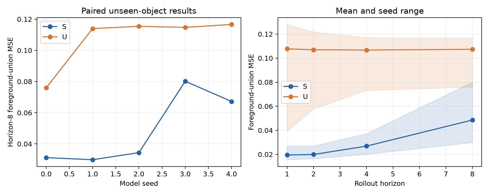
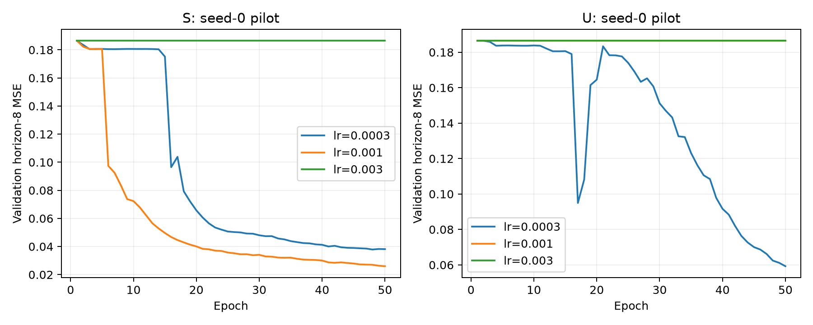
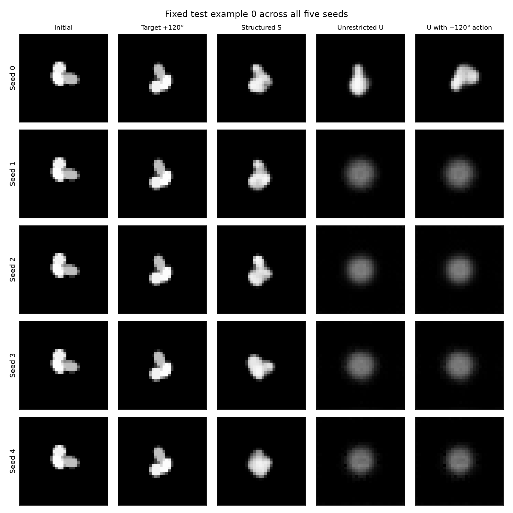
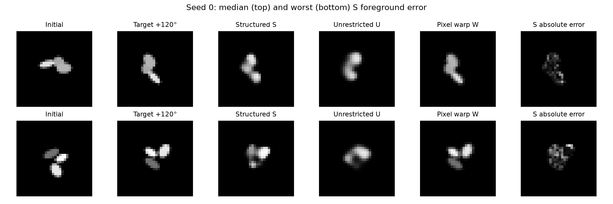

# E0 report: prescribed SO(2) action and image prediction

2026-10-04 · Completed locally · Contract: [E0-v1.1](../SPEC.md)

## Outcome and decision

**E0 passes its preregistered numerical gates.** The structured model reduced unseen-object, eight-step foreground-union MSE by **54.8%** relative to the unrestricted transition: **0.048574 versus 0.107351**. The paired 95% bootstrap interval for relative reduction is **35.8%–70.5%**. Structured prediction won in **5/5 paired model seeds**.

**The mechanistic conclusion remains limited.** Four of the five selected unrestricted checkpoints are effectively insensitive to action sign and reconstruct substantially worse than the structured models. This comparison demonstrates an advantage for the specified structured training recipe under the fixed budget. It does not cleanly show an advantage from compositional extrapolation among equally well-trained predictors. The known image-warp control is much more accurate than either learned system.

Decision: preserve E0 as a completed positive result with a baseline-quality qualification. **Do a baseline optimization check before adding translation, memory, grouping or migration.** Do not remove unfavorable seeds or change E0's outcome retrospectively.

## What was executed

A single fully visible planar object rotates about a known image-center pivot. Each object is a union of three ellipses. The learner observes one 32×32 grayscale image and signed angular increments; it never receives absolute pose, geometry, object IDs or evaluator masks. Shapes are rendered directly from their canonical geometry at 128×128 and downsampled, avoiding cumulative image-resampling error in targets.

The split contains 64 training, 16 validation and 16 unseen test objects, with separate 2-fold and 4-fold symmetric diagnostic objects. There are 8,192 two-transition training episodes. Evaluation uses 32 initial angles per object per schedule, with identical inputs/actions across methods. Absolute orientations are already covered during training: this is a test of new shapes and longer action sequences, not a claim of unseen absolute-angle generalization.

Both learned models use the same convolutional encoder/decoder, 32-dimensional approximately invariant block, 16-dimensional pose-bearing block, losses, data order and 50-epoch budget. Structured S applies prescribed SO(2) harmonic rotations to the pose block. Unrestricted U predicts a residual pose update with an MLP. Both keep the identity block unchanged during rollout. No future observations are fed back during prediction.

Six seed-zero pilot fits compared three learning rates per method. Validation selected **S: 0.001** and **U: 0.0003**; these choices were frozen before the remaining seeds and test evaluation. The selected seed-zero fits were reused. Thus the campaign contains **14 full fits, 700 epochs and 89,600 optimizer steps**, plus two one-epoch smoke fits. No full fit was discarded or retried. Selected checkpoints minimize validation horizon-eight error; they are not necessarily final-epoch checkpoints.

Environment: local Python 3.12.13, PyTorch 2.14.1, NumPy 2.5.3, Apple MPS device, deterministic-algorithm mode, four CPU threads. Versions are pinned in [requirements-lock.txt](../../../requirements-lock.txt). Summed full-fit training/validation wall time was **783.5 seconds (13.1 minutes)**; this excludes environment setup, rendering, final evaluation and analysis. Checkpoints, epoch histories, source snapshots and commands are retained locally under [artifacts](../../../artifacts/e0_rotation/).

S has **181,969** parameters; U has **186,209**. U has more trainable capacity and was not advertised as parameter-matched. A dense multiply-add estimate gives approximately **20.94 million FLOPs** for an eight-step S rollout and **21.01 million** for U: one encoder pass, eight decoder passes, and U's MLP transitions. These estimates count multiply-add as two operations, ignore activation/trigonometric/indexing costs and include transposed-convolution boundary work approximately; they are not measured device FLOPs.

## Primary and control results

Lower error is better. Learned-model entries average five seeds, objects, initial angles and both monotone signs with the registered equal weighting. P and W are deterministic controls.

| Model | Unseen H8 foreground MSE | Unseen H8 full-image MSE | One-step foreground MSE | Seen H8 foreground MSE |
|---|---:|---:|---:|---:|
| Structured S | 0.048574 | 0.005289 | 0.019683 | 0.046094 |
| Unrestricted U | 0.107351 | 0.011787 | 0.110496 | 0.105222 |
| Persistence P | 0.288143 | 0.027368 | 0.038166 | 0.286829 |
| Known pixel warp W | 0.003700 | 0.000406 | 0.003906 | 0.003768 |

The one-step column averages the five training increments on unseen objects. It is distinct from the +15°/−15° horizon-one points in the rollout figure. Interpolation at ±10°, extrapolation at ±30°, mixed sequences and inverse sequences are retained separately in [schedules.csv](schedules.csv).

| Seed | S H8 MSE | U H8 MSE | Relative reduction |
|---|---:|---:|---:|
| 0 | 0.031197 | 0.076000 | 59.0% |
| 1 | 0.029858 | 0.113973 | 73.8% |
| 2 | 0.034403 | 0.115418 | 70.2% |
| 3 | 0.080190 | 0.114757 | 30.1% |
| 4 | 0.067223 | 0.116608 | 42.4% |

The aggregate reduction is the ratio of mean errors, not the mean of these percentages. The interval uses 2,000 paired bootstrap draws over the five seed indices and sixteen unseen-object indices, preserving method pairing and episode groups. It does not treat pixels or rollout horizons as independent samples. Five seeds and one synthetic object generator give preliminary evidence, not a broad population guarantee. The complete paired arrays and bootstrap draws are in [paired_primary.npz](paired_primary.npz).



| Registered decision rule | Observed | Decision |
|---|---|---|
| At least 10% H8 reduction versus U | 54.8% | Pass |
| Paired interval lower bound above zero | 35.8% | Pass |
| Positive reduction in at least four seeds | Five seeds | Pass |
| Beat persistence at H8 | 0.048574 < 0.288143 | Pass |
| One-step error ≤ 1.05×U + 0.0001 | 0.019683 ≤ 0.116121 | Pass |
| No worse full-image error | 0.005289 < 0.011787 | Pass |

## Failures and diagnostic findings

**Optimization is the dominant qualification.** Three seed-zero pilot fits—S at 0.003 and U at 0.001/0.003—produced near-black validation predictions and approximately 0.18646 primary validation error. Their best-checkpoint mean predicted intensities were below 0.00005. These completed but unsuccessful fits remain in the pilot record; they were not implementation crashes. Some later seeds remained poor for many epochs and then recovered, showing why early impressions and last-epoch-only reporting would be misleading.



For the selected U checkpoints at seeds 1–4, flipping all action signs changed predicted images by only **1.2×10⁻¹⁰ to 8.8×10⁻⁹ mean squared difference**. Their full-image reconstruction MSE is approximately **0.0123–0.0125**, versus **0.0010–0.0020** across S seeds. U seed 0 is action-sensitive and reconstructs better (0.00209). Thus nonzero latent variance does not establish a useful action-dependent decoder. U's poor one-step performance—even worse than persistence on average—also warns against interpreting this as an isolated long-horizon effect.

All S checkpoints respond to action sign (image difference approximately 0.0197–0.0234). Their maximum latent composition/inverse errors are at most **4.77×10⁻⁷**. This is a correct implementation of the imposed group law, **not a learned scientific result**. Action-shuffle, sign-flip, latent-variance and identity-stability measurements are in [diagnostics.csv](diagnostics.csv). The identity block is only approximately stable; no claim of complete identity/pose disentanglement follows.



The grid above uses the same predetermined test example across every seed. The nearly unchanged U predictions under opposite actions at seeds 1–4 illustrate the quantitative failure. The separate grid below uses the median and worst S error among seed-zero positive rotations, selected by an explicit error-ranking rule. Thin or separated structures and exact contours remain difficult for the learned decoder.



On the two-fold symmetry set, H8 foreground error was **0.054513 for S versus 0.104356 for U**; on the four-fold set, **0.018181 versus 0.055249**. These are image-prediction diagnostics, not pose-accuracy measurements. The model receives no absolute angle and does not force a unique symmetric-object orientation. Direct-render symmetry checks had zero observed MSE for the audited equivalent-angle cases. This does not establish calibrated pose uncertainty.

The known warp's H8 error is **0.003700**, roughly thirteen times lower than S. The experiment gives an exact action and known pivot, so a geometric image-space solution is strong. Its nonzero discrepancy reflects rasterization/interpolation differences and confirms that decoder learning, rather than physical uncertainty, leaves substantial error. No learned superiority over this control is claimed.

## Integrity and reproducibility

Six contract tests passed: coordinate direction and renderer inverse, group/shape interfaces and paired initialization, absence of targets from the predictor interface, immutable/idempotent prediction scoring, geometry uniqueness/symmetry, and ticket-metadata mutation rejection. A separate MPS 90° warp check matched direct rendering exactly.

The artifact audit passed **133 dataset-file hashes**, confirmed **96 distinct geometry hashes**, verified all **10 selected fit budgets/checkpoints**, and checked **2,048 prediction-ticket/score pairs**. Scores follow commitments, and all held-out evaluation commitments follow the frozen learning-rate decision. Learner files contain only image/action arrays; evaluator truth is separate. No dataset geometries were rejected by the registered asymmetry criterion. See [integrity.json](integrity.json).

Tickets provide auditable ordering and mutation checks within this runner; they are not a security boundary and do not imply statistical independence or identity evidence. Training may use observed future targets for its losses. Final evaluation performs no fitting. No segmentation labels, absolute pose, pretrained model, identity labels, residual dynamics, memory or migration were introduced.

From the repository root, these commands reproduce checks and analysis from retained artifacts:

```sh
PYTHONPATH=experiments/e0_rotation/src .venv/bin/python -m pytest -q
PYTHONPATH=experiments/e0_rotation/src .venv/bin/python -m e0_rotation.audit
PYTHONPATH=experiments/e0_rotation/src .venv/bin/python -m e0_rotation.analyze
```

Training/evaluation commands are documented in the [experiment README](../README.md). Completed runs are reused; do not delete or overwrite them to conduct a new experiment. Exact source/config/environment records accompany each run, and the compact [summary](summary.json), [metrics](metrics.csv), [schedule results](schedules.csv) and figures can be versioned independently of large generated files.

## What to do next

The smallest useful next experiment is **E0b: baseline optimization**, not a new MORPH mechanism. One concrete candidate is zero-initializing U's final residual-transition layer so its initial dynamics are identity-preserving, keeping all other architecture/loss/data-budget choices fixed and reporting all seeds. This is a proposed intervention, not an established fix or an executed experiment.

Before running E0b, register its baseline-health measurements (reconstruction and action response), selection rules and a fresh final audit set. Retain E0's original test results; do not use repeated tuning on this test set as independent confirmation. If a healthy unrestricted predictor still loses at longer horizons, the compositional interpretation becomes stronger. If its performance catches up, the present result was primarily an optimization advantage.

Only after that comparison should E1 introduce noncommuting SE(2) motion. E0 provides no evidence yet for learned motor semantics, correspondence under occlusion, physical individual identity, memory promotion, active disambiguation, representation migration or 3-D embodiment.
